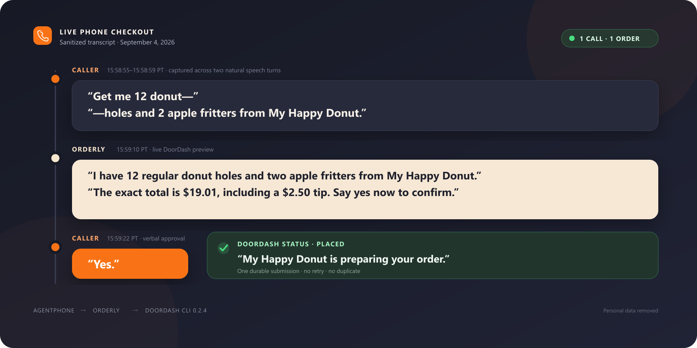
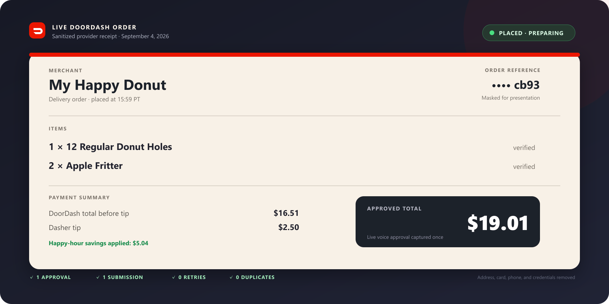

# Orderly

**Food delivery through a phone call.**

Orderly is a voice-first ordering agent built for people who find delivery apps difficult to navigate, especially older adults. A caller describes what they want, hears the exact cart and total, and confirms the purchase with a simple spoken “yes.”

Orderly placed **4th overall at an AI Buildathon hosted at AWS Builder Loft**. During the build, it completed a real $19.01 DoorDash order for 12 donut holes and two apple fritters. The order was submitted once, reconciled successfully, and delivered to the event.

[View the public Orderly dashboard](https://orderly-food-by-phone.lovable.app/)





## How it works

```text
Caller
  ↓
AgentPhone — phone number, transcription, and signed voice events
  ↓
Orderly on Railway — conversation state, validation, and approval controls
  ↓
DoorDash CLI — cart preview, checkout, submission, and status
  ↓
AgentPhone + ElevenLabs voice — spoken response to the caller
```

The real phone path uses AgentPhone webhook voice mode with an ElevenLabs voice. AgentPhone sends each signed transcript turn to the Orderly backend. The backend returns the next response as text, and AgentPhone speaks it using ElevenLabs.

The separate browser demonstration uses a private ElevenLabs Conversational AI agent through a short-lived, server-issued session.

## What the prototype proved

- A natural request can be split across multiple speech turns without losing the active order.
- DoorDash can return an authoritative cart, savings, tip, total, and delivery estimate through its CLI.
- A plain spoken “yes” can approve only the exact active checkout that was just read aloud.
- One approval produces one submission; duplicate webhook delivery cannot produce another order.
- An uncertain provider response enters reconciliation instead of being blindly retried.
- The caller never needs to open a website or mobile app.

## Safety model

Orderly treats checkout as a transaction, not an open-ended model action. The language model and transcripts never receive direct purchase authority.

- The caller must be allowlisted.
- AgentPhone webhooks must pass signature, timestamp, agent, number, and schema validation.
- Approval is bound to the cart, merchant, fulfillment, address, payment method, tip, schedule, and total.
- Any change invalidates approval and requires a new readback.
- A durable single-use ledger prevents duplicate submission.
- Ambiguous results are reconciled before the system reports success.
- Secrets, full addresses, payment information, phone numbers, and audio are excluded from logs and source control.
- Live purchasing is disabled by default and was relocked immediately after the supervised buildathon order.

See [SECURITY.md](SECURITY.md) and [the architecture notes](docs/03-architecture-security.md) for the full threat model.

## Technology

- TypeScript and Node.js
- Express, Zod, Helmet, and Pino
- AgentPhone API and signed webhooks
- ElevenLabs voice and Conversational AI
- DoorDash CLI 0.2.4
- Railway deployment
- Lovable observer dashboard
- SQLite-backed encrypted state and durable transaction records

## Run the safe local demo

The local demo uses fake identities, a fake signing secret, the mock provider, and disabled purchasing. It does not contact DoorDash or send a real message.

Requirements: Node.js 22.13 or newer and npm 10.

```powershell
npm.cmd ci
npm.cmd run verify
npm.cmd run demo
```

In a second terminal:

```powershell
npm.cmd run demo:send
```

Stop the demo with `Ctrl+C`.

## Verification

```powershell
npm.cmd run verify
npm.cmd run audit:prod
```

`verify` runs TypeScript checking, the complete source test suite, a clean production build, and the compiled end-to-end smoke test. The project includes tests for signed webhooks, fragmented speech, cart validation, verbal confirmation, stale previews, duplicate delivery, one-submit behavior, provider uncertainty, reconciliation, and scheduled fulfillment.

## Repository map

- [`src/order`](src/order) — conversation and transaction coordinator
- [`src/doordash`](src/doordash) — narrow DoorDash CLI adapter
- [`src/agentphone`](src/agentphone) — provider client, schemas, and signature verification
- [`src/elevenlabs`](src/elevenlabs) — private browser voice-session endpoint
- [`src/store`](src/store) — encrypted state and durable approval/submission records
- [`contracts`](contracts) — state-machine and tool contracts
- [`test`](test) — end-to-end and boundary tests
- [`docs`](docs) — design decisions, runbooks, and integration notes

## Project status

The buildathon objective is complete. Exactly one supervised live order was placed and reconciled successfully. The repository remains a single-account prototype, not a production ordering service. Multi-user use would require tenant isolation, privacy and legal review, abuse controls, accessibility testing with target users, observability, incident response, and provider approval.

